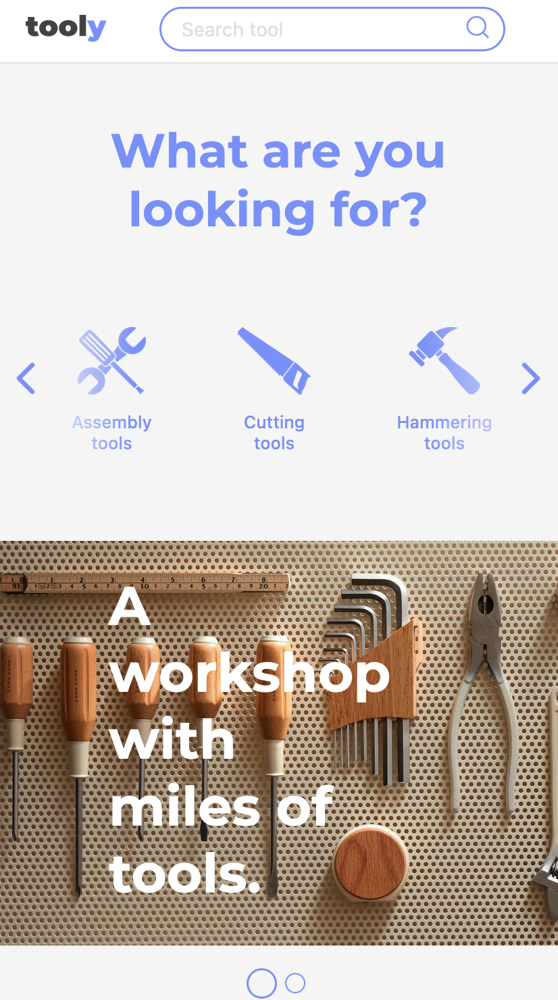
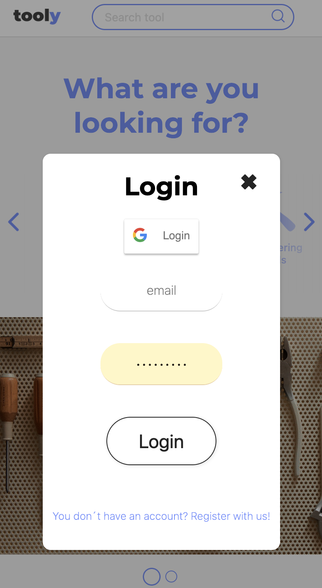
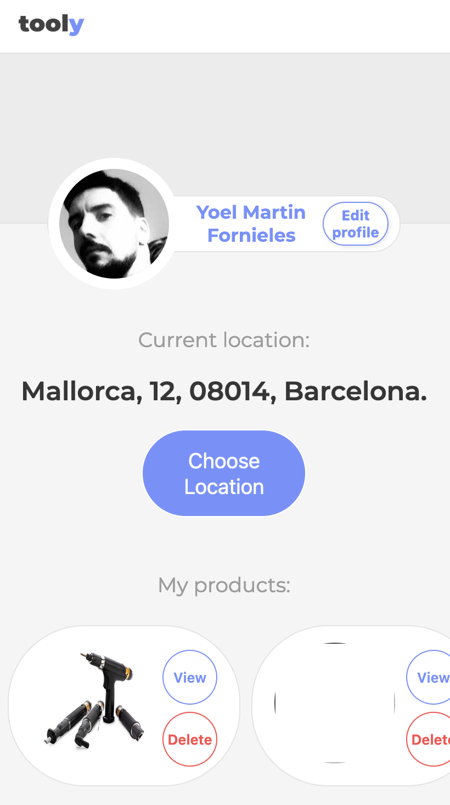
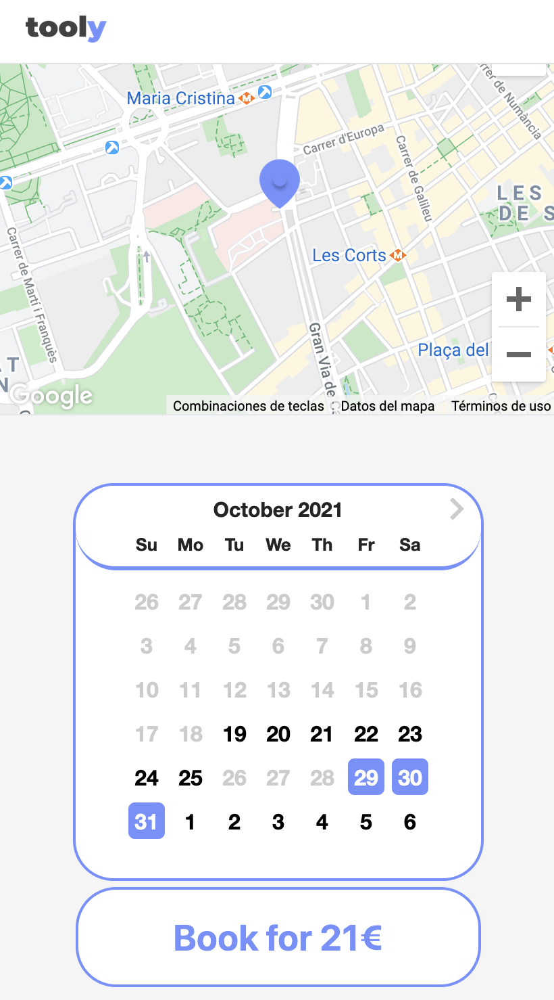
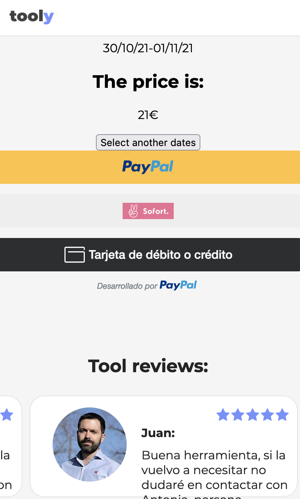
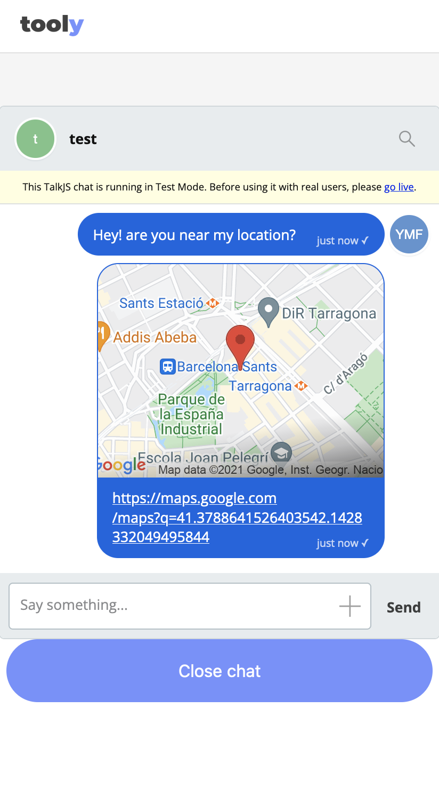

<h1 align="center">
  
</h1>

  TOOLY
   
  <a href="#about"><strong>Explore the screenshots »</strong></a>
   
   
  <a href="https://github.com/yoelmartinfornieles/prj-toolsharing-front/issues/new?assignees=&labels=bug&template=01_BUG_REPORT.md&title=bug%3A+">Report a Bug</a>
  ·
  <a href="https://github.com/yoelmartinfornieles/prj-toolsharing-front/issues/new?assignees=&labels=enhancement&template=02_FEATURE_REQUEST.md&title=feat%3A+">Request a Feature</a>
  .
  <a href="https://github.com/yoelmartinfornieles/prj-toolsharing-front/issues/new?assignees=&labels=question&template=04_SUPPORT_QUESTION.md&title=support%3A+">Ask a Question</a>

 

Table of Contents

- [About](#about)
  - [Built With](#built-with)
- [Getting Started](#getting-started)
  - [Prerequisites](#prerequisites)
  - [Installation](#installation)
- [Usage](#usage)
- [Roadmap](#roadmap)
- [Support](#support)
- [Project assistance](#project-assistance)
- [Contributing](#contributing)
- [Authors & contributors](#authors--contributors)
- [Security](#security)
- [License](#license)
- [Acknowledgements](#acknowledgements)

---

## About

> Because an image is worth a thousand words, try the demo here: https://prj-toolsharing-front.herokuapp.com/

> Tooly is a tool sharing platform.
> The idea is to rent the tools we got at home creating community, sharing resources, evading the consumerism and reutilizing items.
> We aim for platform which allows us to do this all.

Screenshots

 

|                               Home Page                               |                               Login Page                               |
| :-------------------------------------------------------------------: | :--------------------------------------------------------------------: |
|  |  |

|                               Product List                               |                               Product Details                               |
| :-------------------------------------------------------------------: | :--------------------------------------------------------------------: |
|  |  |

|                               Profile Page                               |                               Date selector                                |
| :-------------------------------------------------------------------: | :--------------------------------------------------------------------: |
|  |  |

|                               Payment                              |                               Chat                               |
| :-------------------------------------------------------------------: | :--------------------------------------------------------------------: |
|  |  |

### Built With

 </a>      <a href="https://developer.mozilla.org/en-US/docs/Web/JavaScript" target="_blank">    

## Getting Started

### Installation

run npm i.

In case google maps is giving any problems, try:

yarn install -g; 
yarn add google-map-react; 
yarn add google-maps-react; 

## Usage

As this is the client, please run the following command: npm run start. 
Don't forget the required .env file.

## Roadmap

See the [open issues](https://github.com/yoelmartinfornieles/prj-toolsharing-front/issues) for a list of proposed features (and known issues).

- [Top Feature Requests](https://github.com/yoelmartinfornieles/prj-toolsharing-front/issues?q=label%3Aenhancement+is%3Aopen+sort%3Areactions-%2B1-desc) (Add your votes using the 👍 reaction)
- [Top Bugs](https://github.com/yoelmartinfornieles/prj-toolsharing-front/issues?q=is%3Aissue+is%3Aopen+label%3Abug+sort%3Areactions-%2B1-desc) (Add your votes using the 👍 reaction)
- [Newest Bugs](https://github.com/yoelmartinfornieles/prj-toolsharing-front/issues?q=is%3Aopen+is%3Aissue+label%3Abug)

## Support

Reach out to the maintainer at one of the following places:

- [GitHub issues](https://github.com/yoelmartinfornieles/prj-toolsharing-front/issues/new?assignees=&labels=question&template=04_SUPPORT_QUESTION.md&title=support%3A+)
- The email which is located [in GitHub profile](https://github.com/yoelmartinfornieles)

## Project assistance

If you want to say **thank you** or/and support active development of Tooly:

- Add a [GitHub Star](https://github.com/yoelmartinfornieles/prj-toolsharing-front) to the project.
- Tweet about the PROJECT_NAME on your Twitter.
- Write interesting articles about the project on [Dev.to](https://dev.to/), [Medium](https://medium.com/) or personal blog.

Together, we can make Tooly **better**!

## Contributing

First off, thanks for taking the time to contribute! Contributions are what make the open-source community such an amazing place to learn, inspire, and create. Any contributions you make will benefit everybody else and are **greatly appreciated**.

We have set up a separate document containing our [contribution guidelines](docs/CONTRIBUTING.md).

Thank you for being involved!

## Authors & contributors

The original setup of this repository is by The Tooly team inc.

For a full list of all authors and contributors, check [the contributor's page](https://github.com/yoelmartinfornieles/prj-toolsharing-front/contributors).

## Security

Tooly follows good practices of security, but 100% security can't be granted in software.
Tooly is provided **"as is"** without any **warranty**. Use at your own risk.

_For more info, please refer to the [security](docs/SECURITY.md)._

## License

This project is licensed under the **MIT license**.

See [LICENSE](LICENSE) for more information.

